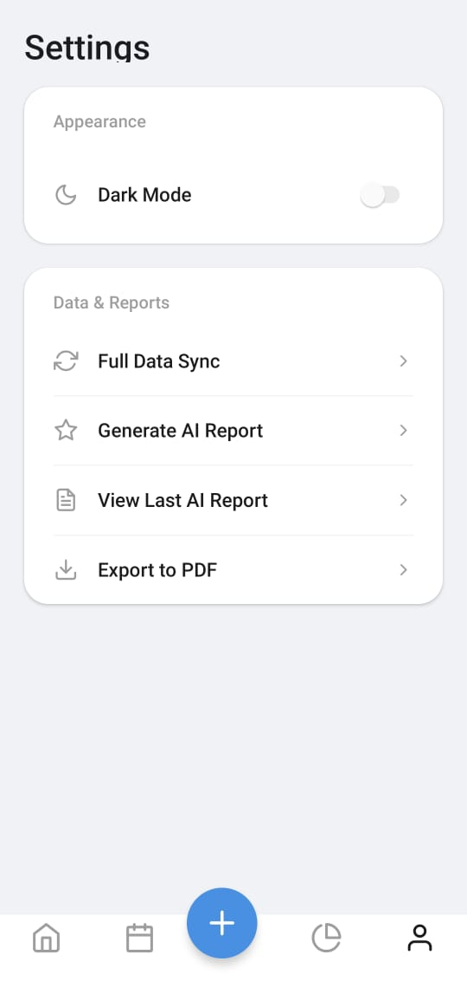

# Nidhi - Personal Finance Tracker


A comprehensive, privacy-first personal finance tracker powered by **React Native**, **Expo**, and **Google Sheets**. Nidhi combines **local offline storage** with **cloud syncing** to ensure your data is always safe and accessible.

---

## 📖 Table of Contents

* [Features](#-features)
* [Screenshots](#-screenshots)
* [Architecture Overview](#-architecture-overview)
* [Tech Stack](#-tech-stack)
* [Installation](#-installation)
* [Google Apps Script Setup](#-google-apps-script-setup)
* [Environment Variables](#-environment-variables)
* [Running the App](#-running-the-app)
* [Building for Production](#-building-for-production)
* [API Endpoints](#-api-endpoints)
* [Contributing](#-contributing)
* [License](#-license)

---

## ✨ Features

* 💵 **Income & Expense Tracking** – Add, edit, and delete both income and expense transactions.
* 📅 **Monthly Budgeting** – Set monthly budgets and track spending in real-time.
* 🧾 **Detailed History** – View transactions grouped by month with income, expenses, and savings summaries.
* 📊 **Advanced Reports** – Visualize data with dynamic pie and bar charts.
* 🤖 **AI-Powered Analysis** – Get personalized financial wellness reports using the Google Gemini API.
* 📑 **PDF & CSV Export** – Export full transaction history as PDF or CSV.
* ☁️ **Cloud Sync** – Securely sync data to your private Google Sheet.
* 📴 **Offline Mode with Local Database** – Transactions are first stored in a **local SQLite database**. They are automatically synced to Google Sheets when internet is available.
* 🔄 **Background Syncing** – Changes are queued locally and synced periodically.
* 🌙 **Light & Dark Mode** – Consistent, theme-aware design.
* 🔐 **Secure Authentication** – Sign in securely with Google.

---

## 📸 Screenshots

Here's a sneak peek of **Nidhi** in action. The app supports a clean, consistent design in both light and dark modes.

### Light Mode

<p align="center">
  
  
  
</p>

<p align="center">
  
  
</p>

### Dark Mode

<p align="center">
  
  
  
</p>

<p align="center">
  
</p>

---

## 🏗️ Architecture Overview

Nidhi is designed with **offline-first architecture** to ensure reliability and privacy:

```
User Interface (React Native Screens)
          ⬇
   AppContext (Global State Management)
          ⬇
   Local Database (Expo SQLite)
          ⬇             ⬇
 Background Sync Service      ↔      Google Sheets API (Apps Script Backend)
```

* **SQLite (Local Storage):** Stores all transactions and budgets offline.
* **AppContext:** Acts as a bridge between the UI and the local database, ensuring instant updates.
* **Background Sync:** Periodically pushes pending changes from SQLite to Google Sheets when online.
* **Google Sheets API:** Serves as the cloud backend for backup, analytics, and cross-device access.

This layered approach ensures:

* ✅ **Offline-first experience** (app works even without internet)
* ✅ **Seamless cloud sync** (data is never lost)
* ✅ **Privacy-first design** (your sheet, your data)

---

## 🚀 Tech Stack

* **Framework:** React Native (Expo)
* **Navigation:** Expo Router (File-based)
* **Local Storage:** Expo SQLite (with migrations, indexing, and UUID support)
* **Cloud Backend:** Google Sheets + Google Apps Script
* **AI Integration:** Google Gemini API
* **Deployment:** EAS (Expo Application Services)

---

## ⚙️ Installation

1. Clone this repository:

   ```bash
   git clone https://github.com/yourusername/nidhi.git
   cd nidhi
   ```
2. Install dependencies:

   ```bash
   npm install
   ```
3. Install EAS CLI:

   ```bash
   npm install -g eas-cli
   ```
4. Log in to Expo:

   ```bash
   eas login
   ```

---

## 🛠 Google Apps Script Setup

The `Code.gs` file is located in the **root directory** of this project. Copy its contents into your Google Apps Script project to enable backend functionality.

1. Create a new Google Sheet and name it **Nidhi Finance Tracker**.
2. Add two tabs:

   * **Transactions** → Headers: `Date | Category | Amount | Notes | Type | uuid`
   * **Budgets** → Headers: `MonthYear | BudgetAmount`
3. In Google Sheets → **Extensions > Apps Script**, paste the contents of [`Code.gs`](./Code.gs).
4. Replace the placeholders:

   * `YOUR_GOOGLE_SHEET_ID_HERE`
   * `YOUR_SECRET_KEY`
5. Deploy as a **Web App**:

   * Execute as: **Me**
   * Who has access: **Anyone**
6. Copy the deployment URL – this will be used as `EXPO_PUBLIC_GOOGLE_SHEETS_API_URL`.

---

## 🔑 Environment Variables

Create a `.env` file in the project root:

```bash
EXPO_PUBLIC_GEMINI_API_KEY="YOUR_GEMINI_API_KEY"
EXPO_PUBLIC_GOOGLE_SHEETS_API_URL="YOUR_WEB_APP_URL"
EXPO_PUBLIC_GOOGLE_SHEETS_API_KEY="YOUR_SECRET_KEY_FROM_CODE.GS"
```

Add `.env` to `.gitignore` to keep your keys safe.

---

## ▶️ Running the App

```bash
npx expo start
```

Scan the QR code with **Expo Go** to launch the app.

---

## 📦 Building for Production (APK)

1. Push secrets to EAS:

   ```bash
   eas secret:push --scope project --env-file ./.env
   ```
2. Configure `eas.json`:

   ```json
   {
     "build": {
       "preview": {
         "distribution": "internal",
         "android": {
           "buildType": "apk"
         },
         "env": {
           "EXPO_PUBLIC_GEMINI_API_KEY": "${secrets.EXPO_PUBLIC_GEMINI_API_KEY}",
           "EXPO_PUBLIC_GOOGLE_SHEETS_API_URL": "${secrets.EXPO_PUBLIC_GOOGLE_SHEETS_API_URL}",
           "EXPO_PUBLIC_GOOGLE_SHEETS_API_KEY": "${secrets.EXPO_PUBLIC_GOOGLE_SHEETS_API_KEY}"
         }
       }
     }
   }
   ```
3. Start build:

   ```bash
   eas build --platform android --profile preview
   ```

Download the APK from the **EAS build page**.

---

## 🌐 API Endpoints

All requests require the `apiKey` matching your secret key from `Code.gs`.

### Transactions

* `addTransaction`
* `updateTransaction`
* `deleteTransaction`
* `getTransactions`

### Budgets

* `setBudget`
* `getBudgets`

(See [Code.gs](./Code.gs) for implementation details.)

---

## 🤝 Contributing

Contributions are welcome! 🎉

1. Fork the repo
2. Create a feature branch
3. Submit a Pull Request

---

## 📜 License

This project is licensed under the **MIT License**.
