# Nidhi - Personal Finance Tracker


A comprehensive, privacy-first personal finance tracker powered by **React Native**, **Expo**, and **Google Sheets**. Nidhi combines **local offline storage** with **cloud syncing** to ensure your data is always safe and accessible.

---

## 📖 Table of Contents

* [Features](#-features)
* [Screenshots](#-screenshots)
* [Architecture Overview](#-architecture-overview)
* [Tech Stack](#-tech-stack)
* [Installation](#-installation)
* [Google Apps Script Setup](#-google-apps-script-setup)
* [Backend Setup (Vercel)](#-backend-setup-vercel)
* [Environment Variables](#-environment-variables)
* [Running the App](#-running-the-app)
* [Building for Production](#-building-for-production)
* [API Endpoints](#-api-endpoints)
* [Contributing](#-contributing)
* [License](#-license)

---

## ✨ Features

* 💵 **Income & Expense Tracking** – Add, edit, and delete both income and expense transactions.
* 📅 **Monthly Budgeting** – Set monthly budgets and track spending in real-time.
* 📈 **Investment Tracking** – Record stock, mutual fund, crypto, or other investments with value updates over time.
* 🧾 **Detailed History** – View transactions grouped by month with income, expenses, savings, and investments summaries.
* 📊 **Advanced Reports** – Visualize data with dynamic pie and bar charts.
* 🤖 **AI-Powered Analysis** – Get personalized financial wellness reports using the Google Gemini API.
* 📑 **PDF & CSV Export** – Export full transaction and investment history as PDF or CSV.
* ☁️ **Cloud Sync** – Securely sync data to your private Google Sheet.
* 📴 **Offline Mode with Local Database** – Transactions and investments are first stored in a **local SQLite database**. They are automatically synced to Google Sheets when internet is available.
* 🔄 **Background Syncing** – Changes are queued locally and synced periodically.
* 🌙 **Light & Dark Mode** – Consistent, theme-aware design.
* 🔐 **Secure Authentication** – Sign in securely with Google.

---

## 📸 Screenshots

### Light Mode

<p align="center">
  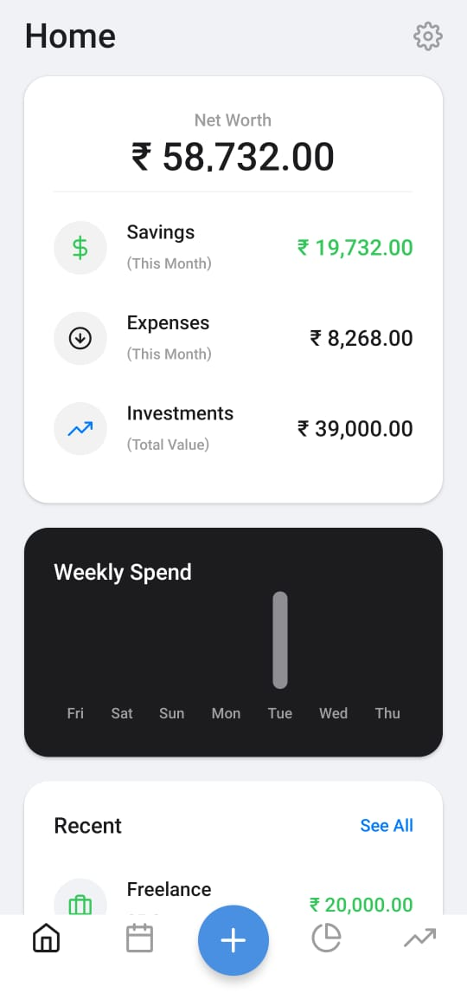
  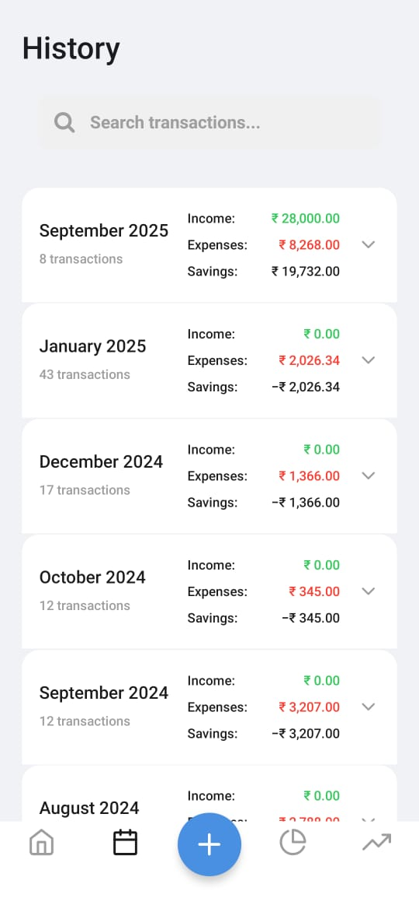
  
</p>

<p align="center">
  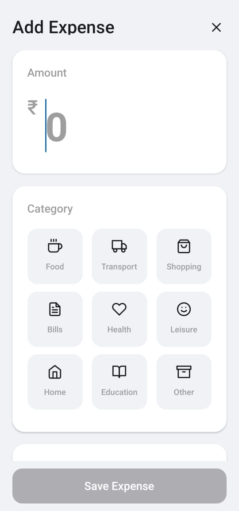
  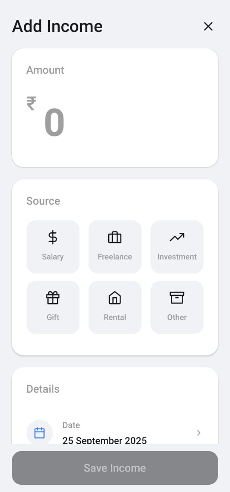
  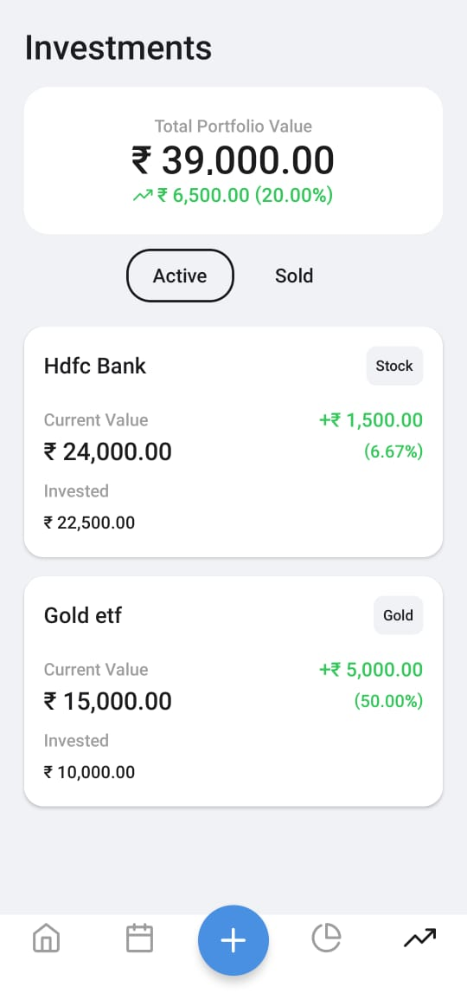
</p>

---

### Dark Mode

<p align="center">
  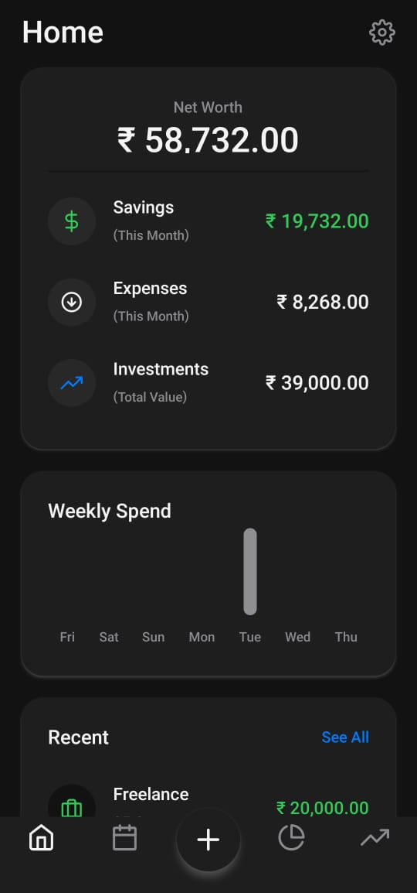
  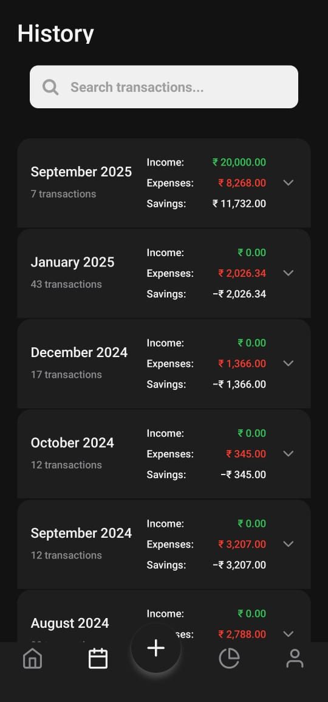
  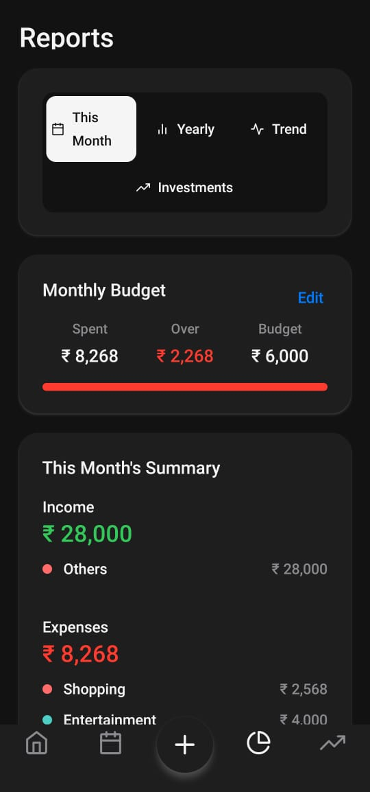
</p>

<p align="center">
  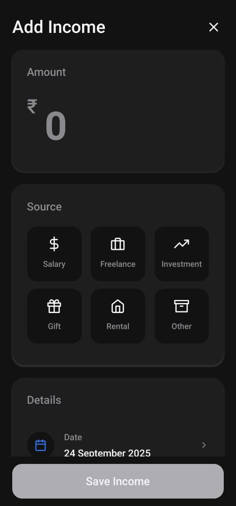
  
  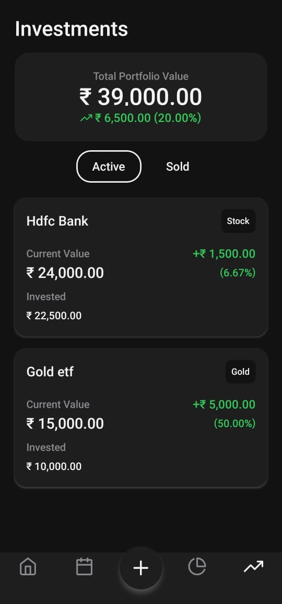
</p>

<p align="center">
  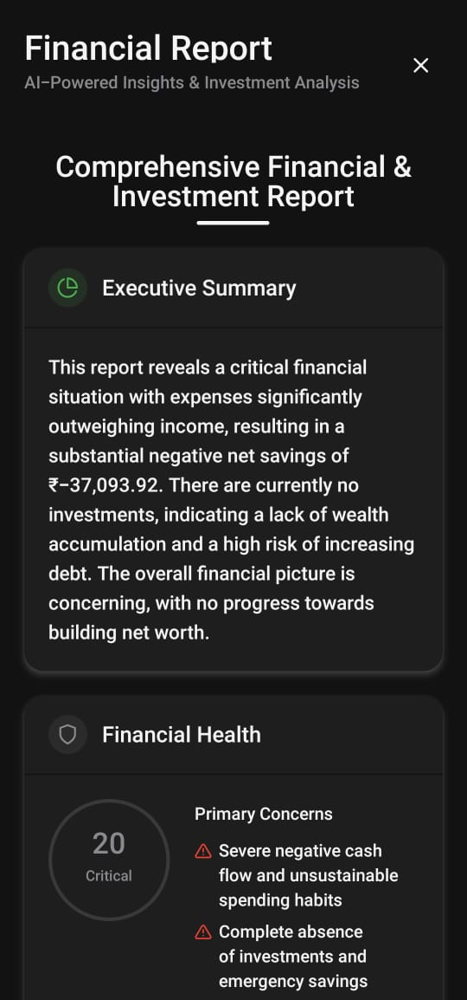
  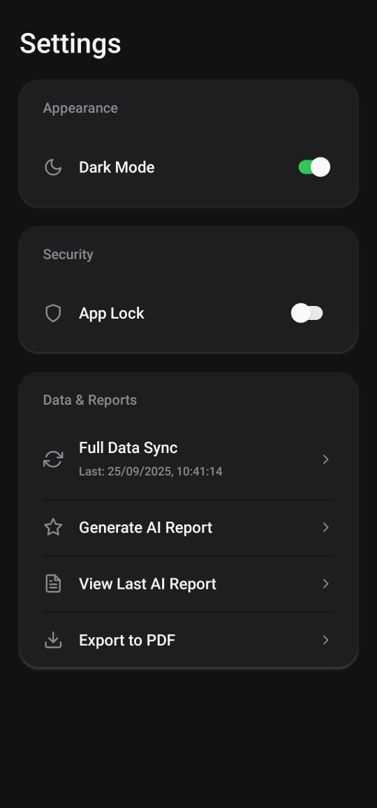
  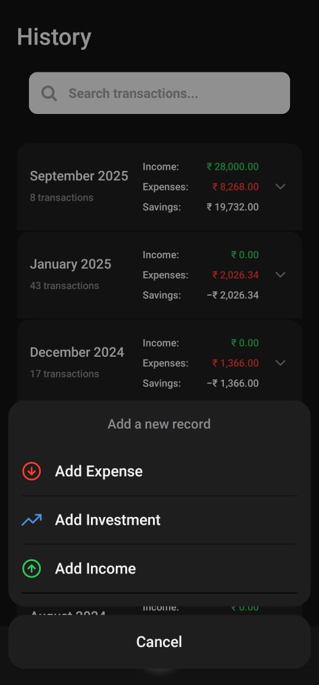
</p>

---

## 🏗️ Architecture Overview

Nidhi is designed with **offline-first architecture** to ensure reliability, security, and privacy:

```
User Interface (React Native Screens)
          ⬇
   AppContext (Global State Management)
          ⬇
   Local Database (Expo SQLite)
          ⬇             ⬇
 Background Sync Service      ↔      Vercel Backend (API Routes)
                                      ⬇
                            Google Sheets API & Gemini API
```

* **SQLite (Local Storage):** Stores all transactions, budgets, and investments offline.
* **AppContext:** Acts as a bridge between the UI and the local database, ensuring instant updates.
* **Background Sync:** Periodically pushes pending changes from SQLite to the backend when online.
* **Vercel Backend:** Handles secure communication with Google Sheets & Gemini API using server-only keys.
* **Google Sheets API:** Serves as the cloud backend for backup, analytics, and cross-device access.
* **Gemini API:** Powers AI-based insights.

This layered approach ensures:

* ✅ **Offline-first experience** (app works even without internet)
* ✅ **Seamless cloud sync** (data is never lost)
* ✅ **Server-side security** (API keys are never exposed in the app)
* ✅ **Privacy-first design** (your sheet, your data)

---

## 🚀 Tech Stack

* **Framework:** React Native (Expo)
* **Navigation:** Expo Router (File-based)
* **Local Storage:** Expo SQLite (with migrations, indexing, and UUID support)
* **Backend:** Vercel Serverless Functions (Node.js + Axios)
* **Cloud Backend:** Google Sheets + Google Apps Script
* **AI Integration:** Google Gemini API
* **Deployment:** EAS (Expo Application Services)

---

## ⚙️ Installation

1. Clone this repository:

   ```bash
   git clone https://github.com/yourusername/nidhi.git
   cd nidhi
   ```
2. Install dependencies:

   ```bash
   npm install
   ```
3. Install EAS CLI:

   ```bash
   npm install -g eas-cli
   ```
4. Log in to Expo:

   ```bash
   eas login
   ```

---

## 🛠 Google Apps Script Setup

The `Code.gs` file is located in the **root directory** of this project. Copy its contents into your Google Apps Script project to enable backend functionality.

1. Create a new Google Sheet and name it **Nidhi Finance Tracker**.
2. Add three tabs:

   * **Transactions** → Headers: `Date | Category | Amount | Notes | Type | uuid`
   * **Budgets** → Headers: `MonthYear | BudgetAmount`
   * **Investments** → Headers: `Date | Asset | Type | Units | PricePerUnit | TotalValue | Notes | uuid`
3. In Google Sheets → **Extensions > Apps Script**, paste the contents of [`Code.gs`](./Code.gs).
4. Replace the placeholders:

   * `YOUR_GOOGLE_SHEET_ID_HERE`
   * `YOUR_SECRET_KEY`
5. Deploy as a **Web App**:

   * Execute as: **Me**
   * Who has access: **Anyone**
6. Copy the deployment URL – this will be used by the Vercel backend.

---

## 🖥️ Backend Setup (Vercel)

All sensitive API keys are now stored securely in your **Vercel project** and never exposed to the client app.

1. In your Vercel dashboard, go to **Project Settings > Environment Variables**.

2. Add the following keys:

   ```bash
   GOOGLE_SHEETS_API_KEY=your_secret_key_from_code.gs
   GOOGLE_SHEETS_API_URL=your_apps_script_webapp_url
   GEMINI_API_KEY=your_gemini_api_key
   CLIENT_API_KEY=your_custom_client_key_for_auth
   ```

3. Deploy your project to Vercel. The serverless functions (`/api/sheets` and `/api/gemini`) will use these keys securely.

4. Your React Native app will now connect only to the **Vercel backend**.

---

## 🔑 Environment Variables

Create a `.env` file in the project root **for the Expo app**:

```bash
EXPO_PUBLIC_BACKEND_URL="https://your-vercel-app.vercel.app/api"
```

> Note: Only the backend URL is stored in the client app. All sensitive keys remain on the server.

---

## ▶️ Running the App

```bash
npx expo start
```

Scan the QR code with **Expo Go** to launch the app.

---

## 📦 Building for Production (APK)

1. Push secrets to EAS:

   ```bash
   eas secret:push --scope project --env-file ./.env
   ```
2. Configure `eas.json`:

   ```json
   {
     "build": {
       "preview": {
         "distribution": "internal",
         "android": {
           "buildType": "apk"
         },
         "env": {
           "EXPO_PUBLIC_BACKEND_URL": "${secrets.EXPO_PUBLIC_BACKEND_URL}"
         }
       }
     }
   }
   ```
3. Start build:

   ```bash
   eas build --platform android --profile preview
   ```

Download the APK from the **EAS build page**.

---

## 🌐 API Endpoints

All client requests go through the **Vercel backend** and require a valid `CLIENT_API_KEY`.

### `/api/sheets`

* **Transactions:** `addTransaction`, `updateTransaction`, `deleteTransaction`, `getTransactions`
* **Budgets:** `setBudget`, `getBudgets`
* **Investments:** `addInvestment`, `updateInvestment`, `deleteInvestment`, `getInvestments`

### `/api/gemini`

* Accepts POST requests with `{ prompt: "your text" }`
* Returns AI-generated insights from the Gemini API.

---

## 🤝 Contributing

Contributions are welcome! 🎉

1. Fork the repo
2. Create a feature branch
3. Submit a Pull Request

---

## 📜 License

This project is licensed under the **MIT License**.
