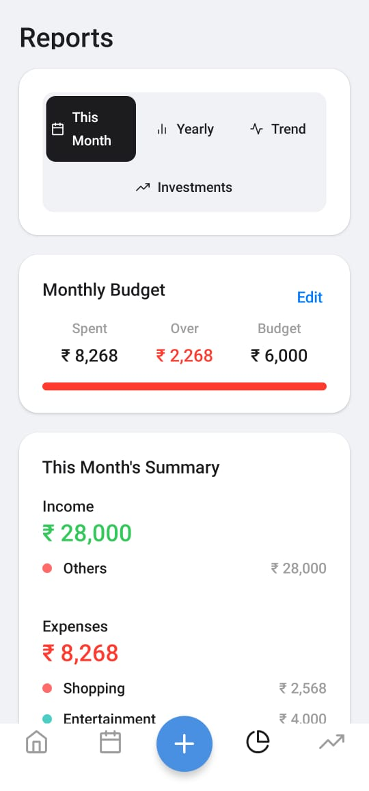
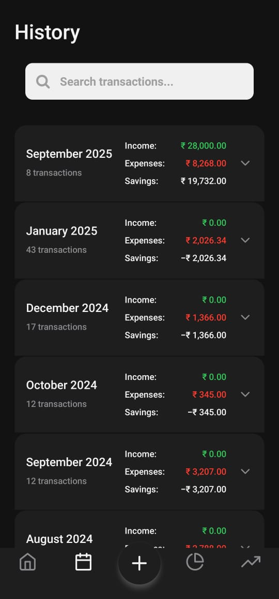

<p align="center">
  
</p>

<h1 align="center">Nidhi - Personal Finance Tracker</h1>

<p align="center">
  A comprehensive, cross-platform personal finance tracker built with <b>React Native</b> and <b>Expo</b>.
</p>

<p align="center">
  <a href="https://opensource.org/licenses/MIT">
    
  </a>
  <a href="https://github.com/your-github-username/nidhi/stargazers">
    
  </a>
</p>

---

## ✨ Features

* 💵 **Income & Expense Tracking** – Add, edit, and delete both income and expense transactions.
* 📅 **Monthly Budgeting** – Set monthly budgets and track spending in real-time.
* 🧾 **Detailed History** – View transactions grouped by month with income, expenses, and savings summaries.
* 📊 **Advanced Reports** – Visualize data with dynamic pie and bar charts.
* 🤖 **AI-Powered Analysis** – Get personalized financial wellness reports using the Google Gemini API.
* 📑 **PDF & CSV Export** – Export full transaction history as PDF or CSV.
* ☁️ **Cloud Sync** – Securely sync data to your private Google Sheet.
* 📴 **Offline Support** – Works offline and syncs when reconnected.
* 🌙 **Light & Dark Mode** – Consistent, theme-aware design.
* 🔐 **Secure Authentication** – Sign in securely with Google.

---

## 📸 Screenshots

Here’s a detailed look at **Nidhi** in action. The app supports a clean, consistent design in both light and dark modes.

### Home Screen

#### Light Mode


#### Dark Mode


---

### Reports Screen

#### Light Mode



#### Dark Mode


---

### History Screen

#### Light Mode


#### Dark Mode



---

### Add Income / Expense

#### Add Income (Dark Mode)


#### Add Expense (Light Mode)


---

### Settings Screen

#### Light Mode


---

## 🚀 Tech Stack

* **Framework:** React Native (Expo)
* **Navigation:** Expo Router (File-based)
* **Database:** Expo SQLite
* **Backend:** Google Sheets + Google Apps Script
* **AI Integration:** Google Gemini API
* **Deployment:** EAS (Expo Application Services)

---

## 🛠️ Project Setup Guide

### 1. Prerequisites

* Node.js (LTS)
* Git
* Expo account
* Expo Go app (iOS/Android)

### 2. Local Installation

```bash
# Clone the repository
git clone https://github.com/your-github-username/nidhi.git
cd nidhi

# Install dependencies
npm install

# Install the EAS CLI
npm install -g eas-cli

# Log in to Expo
eas login
```

### 3. Google Sheets & Apps Script Setup

#### Step 3.1: Create the Google Sheet

1. Go to Google Sheets and create a new spreadsheet.
2. Rename it: **Nidhi Finance Tracker**.
3. Create two tabs: **Transactions** and **Budgets**.
4. Add headers:

**Transactions Sheet**
\| Date | Category | Amount | Notes | Type | uuid |

**Budgets Sheet**
\| MonthYear | BudgetAmount |

5. Copy the **Sheet ID** from the URL.

#### Step 3.2: Deploy Google Apps Script

1. In Google Sheet → Extensions → Apps Script.
2. Open the `Code.gs` file located inside the **root directory** of this project.
3. Copy its contents and paste them into the Apps Script editor.
4. Replace `YOUR_GOOGLE_SHEET_ID_HERE` with your Sheet ID.
5. Deploy as Web App:

   * Description: **Nidhi API v1**
   * Execute as: **Me**
   * Who has access: **Anyone**
6. Copy the **Web App URL**.

### 4. Gemini API Key Setup

1. Go to **Google AI Studio**.
2. Generate an API Key.
3. Copy the key.

### 5. Environment Variables

Create a `.env` file in project root:

```bash
EXPO_PUBLIC_GEMINI_API_KEY="YOUR_GEMINI_API_KEY"
EXPO_PUBLIC_GOOGLE_SHEETS_API_URL="YOUR_WEB_APP_URL"
EXPO_PUBLIC_GOOGLE_SHEETS_API_KEY="YOUR_SECRET_KEY_FROM_CODE.GS"
```

Add `.env` to `.gitignore`.

### 6. Running the App

```bash
npx expo start
```

Scan the QR code with **Expo Go**.

---

## 📦 Building for Production (APK)

### 1. Push Secrets to EAS

```bash
eas secret:push --scope project --env-file ./.env
```

(or use `eas env:push` if prompted)

### 2. Configure eas.json

```json
{
  "build": {
    "preview": {
      "distribution": "internal",
      "android": {
        "buildType": "apk"
      },
      "env": {
        "EXPO_PUBLIC_GEMINI_API_KEY": "${secrets.EXPO_PUBLIC_GEMINI_API_KEY}",
        "EXPO_PUBLIC_GOOGLE_SHEETS_API_URL": "${secrets.EXPO_PUBLIC_GOOGLE_SHEETS_API_URL}",
        "EXPO_PUBLIC_GOOGLE_SHEETS_API_KEY": "${secrets.EXPO_PUBLIC_GOOGLE_SHEETS_API_KEY}"
      }
    }
  }
}
```

### 3. Start Build

```bash
eas build --platform android --profile preview
```

Download the APK from the **EAS build page**.

---

## 🤝 Contributing

Contributions are welcome! 🎉

1. Fork the repo
2. Create a feature branch
3. Submit a Pull Request

---

## 📜 License

This project is licensed under the **MIT License**.
